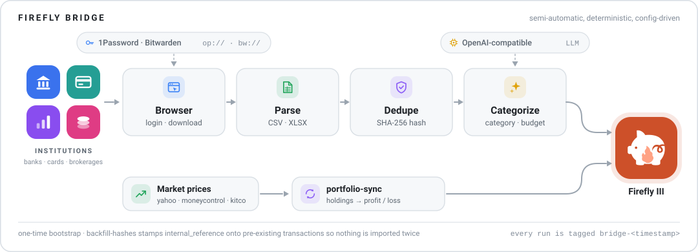

<p align="center">
  <picture>
    <source media="(prefers-color-scheme: dark)" srcset="assets/banner-dark.svg">
    <source media="(prefers-color-scheme: light)" srcset="assets/banner-light.svg">
    
  </picture>
</p>

# Firefly Bridge

A semi-automatic bridge between banks, brokerages, and [Firefly III](https://firefly-iii.org/).

Firefly Bridge fetches transactions and balances directly from financial institutions using browser automation and CSV exports, then imports them into [Firefly III](https://firefly-iii.org/) in a deterministic and repeatable way. The goal is not to provide a universal, plug-and-play solution, but a transparent and customizable pipeline that can be adapted to any institution or account structure.

All institution-specific logic — login flows, CSS selectors, CSV column mappings, and secret references — is defined in a `config.yaml` file, keeping sensitive details private and configuration explicit. See [CONFIG-DSL.md](CONFIG-DSL.md) for a complete reference of every available option.

## Installation

Pre-built binaries are published to [GitHub Releases](https://github.com/rajkumaar23/firefly-bridge/releases) on **every push to `main`** — each release is tagged `sha-<commit>` and contains binaries for macOS and Linux, amd64 and arm64. `checksums.txt` covers every binary.

**Latest release, one-liner** (installs `firefly-bridge` to `~/.local/bin`, verifies the checksum):

```bash
a="firefly-bridge-$(uname -s | tr '[:upper:]' '[:lower:]')-$(uname -m | sed 's/x86_64/amd64/;s/aarch64/arm64/')"; curl -fsSL -o /tmp/$a "https://github.com/rajkumaar23/firefly-bridge/releases/latest/download/$a" && curl -fsSL "https://github.com/rajkumaar23/firefly-bridge/releases/latest/download/checksums.txt" | grep " $a$" | awk -v d=/tmp '{print $1"  "d"/"$2}' | shasum -a 256 -c - --status && install -m 755 /tmp/$a ~/.local/bin/firefly-bridge
```

| Platform | Binary |
|---|---|
| macOS (Apple Silicon) | `firefly-bridge-darwin-arm64` |
| macOS (Intel) | `firefly-bridge-darwin-amd64` |
| Linux | `firefly-bridge-linux-amd64` / `firefly-bridge-linux-arm64` |

The companion tools `portfolio-sync` and `backfill-hashes` are in the same releases — install the same way with their asset names.

### Updating

`firefly-bridge` checks for a newer release (at most once a day, cached) and prints a warning when one is available, including a copy-paste command to install it:

```
WARN[0000] firefly-bridge sha-722083f is out of date — sha-abc1234 is available (download: https://github.com/.../firefly-bridge-darwin-arm64)
WARN[0000] to update: curl -fsSL -o /tmp/firefly-bridge-darwin-arm64 '...' && ... | grep " firefly-bridge-darwin-arm64$" | shasum -a 256 -c - --status && install -m 755 /tmp/firefly-bridge-darwin-arm64 ~/.local/bin/firefly-bridge
```

Any failure to reach GitHub is silent — the check never blocks or delays a sync.

### Data & state files

All persistent data lives in one per-platform directory (no more CWD-scattered files):

| Platform | Directory |
|---|---|
| macOS | `~/Library/Caches/firefly-bridge/` |
| Linux | `$XDG_CACHE_HOME/firefly-bridge/` (default `~/.cache/firefly-bridge/`) |

Contents: `.state.json` (sync state), `chromedp-data/` (browser session — this grows large), `downloads/` (ephemeral), `update-check.json`. If you previously ran from a project directory, the state file and browser profile are copied in automatically on the first run (the old files are left in place). Delete the cache directory to force re-login everywhere.

To build from source instead, `go build ./cmd/firefly-bridge` (Go 1.25+, CGO required for the 1Password SDK) produces a `dev` build: no update check, one info line at startup.

---

> [!CAUTION]
> **Back up your Firefly III database before running any tool in this project.**
>
> `firefly-bridge`, `backfill-hashes`, and `portfolio-sync` all write directly to your Firefly III instance via its API. Mistakes in configuration or unexpected data can result in incorrect or duplicate transactions that are difficult to reverse. Export a database snapshot before each run, and verify the results on a test instance first if possible.

### How firefly-bridge tracks state in Firefly

firefly-bridge relies on two Firefly III fields to operate correctly and avoid duplicating data:

- **`internal_reference` (transactions)** — used for regular accounts. Every transaction imported by firefly-bridge is tagged with a deterministic SHA-256 hash stored in this field. Before importing a transaction, firefly-bridge searches Firefly for a matching `internal_reference` and skips the transaction if one is found. **Do not manually clear or overwrite this field** on transactions managed by firefly-bridge.
- **Account notes (investment accounts)** — used to store the current holdings of an investment account (e.g. `AAPL=10.00000000,VTSAX=50.00000000`). `portfolio-sync` reads this field to calculate real-time portfolio value. **Do not use the notes field for other purposes** on accounts managed by firefly-bridge.

> [!WARNING]
> **Run `backfill-hashes` before your first firefly-bridge sync if you already have transactions in Firefly.**
>
> firefly-bridge uses the `internal_reference` field on each transaction to detect duplicates. If your Firefly database already contains transactions that were imported manually or by another tool, those transactions will lack an `internal_reference` and firefly-bridge will re-import them as duplicates on its first run.
>
> The `backfill-hashes` companion tool walks every asset account, computes the correct hash for each existing transaction, and writes it to `internal_reference` — preventing duplication without touching any other transaction data. Run it once before enabling firefly-bridge:
>
> ```
> backfill-hashes --host http://firefly.example.com --token <token>
> ```
>
> The tool will show you exactly how many transactions and splits will be updated for each account and ask for your confirmation before making any changes.

## Backfill Hashes

`backfill-hashes` is a one-time setup tool that populates the `internal_reference` field on existing Firefly transactions so that firefly-bridge can identify them as already-imported and will not create duplicates.

### Usage

```
backfill-hashes [flags]
```

| Flag | Type | Default | Description |
|---|---|---|---|
| `--host` | string | `""` | Firefly host URL. Can also be set via `$FIREFLY_HOST`. |
| `--token` | string | `""` | Firefly personal access token. Can also be set via `$FIREFLY_TOKEN`. |
| `--debug` | bool | `false` | Enable verbose debug logging. |

For each asset account the tool will display the number of transaction groups and individual splits that are missing `internal_reference`, then ask:

```
[Checking Account] 42 transaction group(s) | 42 split(s) missing internal_reference
Update? (y/n):
```

Answer `y` to apply the hashes for that account or `n` to skip it. The tool tracks which transaction groups have already been updated, so a single group that appears in multiple accounts' transaction lists (e.g. a transfer) is only updated once.

---

## Firefly Bridge

```
firefly-bridge [flags]
```

| Flag | Type | Default | Description |
|---|---|---|---|
| `-config` | string | `"config.yaml"` | Path to the YAML configuration file. See [CONFIG-DSL.md](CONFIG-DSL.md). |
| `-state` | string | `".state.json"` | Path to the state file that tracks the last successful run per institution and account. |
| `-institution` | string | `""` | Run only the institution with this exact name (case-sensitive). Skips all other institutions and also bypasses cooldown and balance-unchanged checks for the specified institution. |
| `-skip` | string | `""` | Comma-separated list of institution names (case-sensitive) to skip. All other institutions run normally. |
| `-force` | bool | `false` | Bypass the per-institution cooldown and the per-account balance-unchanged skip. Forces a full sync of every institution and account regardless of state. |
| `-sync-days` | int | `10` | Force a full transaction sync for an account after this many days have elapsed since the last sync, even if the scraped balance matches the Firefly balance. |
| `-debug` | bool | `false` | Enable verbose debug logging for firefly-bridge internals. |
| `-cdp-debug` | bool | `false` | Enable verbose debug logging for browser automation. Useful for diagnosing selector issues. |
| `-csv-debug` | bool | `false` | Log every parsed CSV/Excel row with its row number. Useful for diagnosing `skip_head_rows`, `skip_tail_rows`, and column index issues. |
| `-vendors` | string | `""` | Scrape the configured [vendors'](CONFIG-DSL.md#vendors) order history before the sync so their charges are categorized from what was actually bought. `"all"` or a comma-separated list of vendor names; empty disables vendor scraping. Requires `ai.enabled`. |
| `-list-orders` | bool | `false` | Log in to the configured vendors, print every scraped order, and exit without syncing any institution. Combine with `-vendors` to restrict which vendors run (default all). Useful for tuning the `orders` step selectors. |

### Runtime directories

Two directories are created automatically alongside the state file at startup (both in the data dir; see the [Installation](#installation) section):

- `downloads/` — temporary landing zone for CSV/Excel files downloaded during browser automation; files are read and then deleted after each sync. Password-protected Excel files are supported via the `password` field in the `excel` step config (plain string, or an `op://` / `bw://` secret reference).
- `chromedp-data/` — browser user data directory used by the automation session (cookies, cache, local storage). Sessions persist across runs on purpose — it's what lets a login flow use `skip_remaining_if` to skip re-authentication. To explicitly tear one down, add an optional `logout` flow to the institution or vendor entry (see [CONFIG-DSL.md](CONFIG-DSL.md#institutions)).

---

## Portfolio Sync

`portfolio-sync` is a companion service that fetches current market prices for the securities stored in your Firefly investment account notes and creates Profit/Loss transactions in Firefly III. Unlike `firefly-bridge` (which requires a browser and user interaction to download statements), `portfolio-sync` is fully headless and designed to run on a schedule.

### Running as a cron job with Docker Compose

The recommended way to run `portfolio-sync` continuously is alongside [Ofelia](https://github.com/mcuadros/ofelia), a Docker-native job scheduler. The container sleeps indefinitely and Ofelia exec's the binary on your schedule — no separate cron daemon or host access required.

```yaml
services:
  portfolio-sync:
    image: ghcr.io/rajkumaar23/firefly-portfolio-sync:latest
    env_file:
      - stack.env
    entrypoint: ["/bin/sh", "-c", "sleep infinity"]
    restart: unless-stopped
    environment:
      - FIREFLY_HOST=${FIREFLY_HOST}
      - FIREFLY_TOKEN=${FIREFLY_TOKEN}
      - TZ=America/Los_Angeles
    labels:
      ofelia.enabled: "true"
      ofelia.job-exec.portfolio-sync.schedule: "0 20 13 * * *"
      ofelia.job-exec.portfolio-sync.command: "/usr/local/bin/portfolio-sync"

  ofelia:
    image: mcuadros/ofelia:latest
    restart: unless-stopped
    command: daemon --docker
    environment:
      - TZ=America/Los_Angeles
    volumes:
      - /var/run/docker.sock:/var/run/docker.sock:ro
    depends_on:
      - portfolio-sync
```

The schedule uses a 6-field cron expression (seconds first): `0 20 13 * * *` runs daily at 13:20. Adjust to match your preferred sync time and timezone.

---

## License

This project is licensed under the [GNU General Public License v3.0](LICENSE).

The Firefly III mark used in the banner is [`assets/firefly-iii-icon.svg`](assets/firefly-iii-icon.svg), copyright the [Firefly III](https://github.com/firefly-iii/firefly-iii) project and licensed AGPL-3.0. It is included only to identify the software this project integrates with. The institution icons on the left of the banner are generic illustrations, not the logos of any specific bank.
